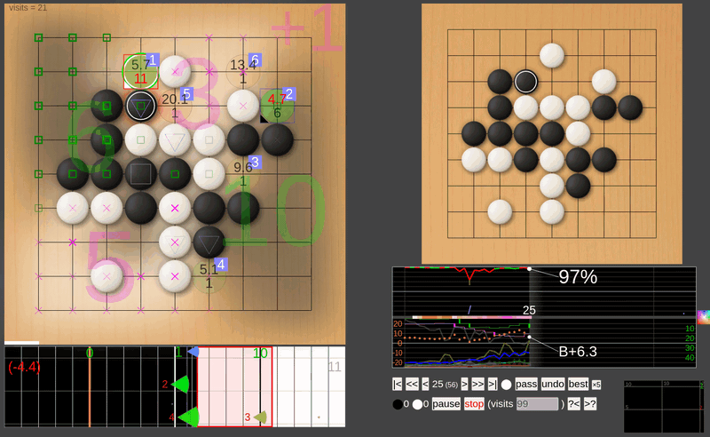
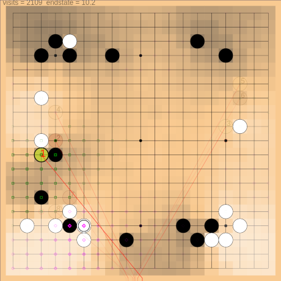

# LizGoban - Leela Zero & KataGo visualizer

LizGoban is an analysis tool of the game Go with
[Leela Zero](https://github.com/gcp/leela-zero)
and [KataGo](https://github.com/lightvector/KataGo).
It is an implementation of
[Lizzie](https://github.com/featurecat/lizzie)-style real-time UI
on [Electron](https://electronjs.org/).
Instead of having a full-featured board editor by itself,
it is attachable to [Sabaki](https://sabaki.yichuanshen.de/)
as subwindows.

## Highlights

1. Leela Zero does not tell the reason of suggestions. So LizGoban aims at a GUI for easy trial of what-if in addition to quick browse of proposed variations. For example, you can use any number of trial boards in parallel, discard a needless one by a single action, and restore the deleted one if necessary.
2. Though Lizzie is amazingly useful, its setup is not easy for many Go players because it needs Java. In this project, the core feature of Lizzie is transported to JavaScript so that they can taste the joy of real-time analysis.
3. Flexibility of JavaScript also enables quick experiments of fun features, e.g. watching Leela Zero vs. [ELF](https://facebook.ai/developers/tools/elf) with real-time detection of the difference between their plans before they play the move actually.
4. Leela Zero's suggestions are not 100% reliable, of course. We hope to get some signs when the suggested moves are unreliable. LizGoban visualizes convergence and consistency of estimations for this purpose. We can notice the case when we should wait for a little more analysis, and will never miss a new rising candidate like the one in the above screenshot.
5. Additionally, various small ideas are implemented, e.g. translucent stones for too long variations, different colors for good/bad/unexpected moves in the win-rate graph, etc.

See below for corresponding features.

## Features

Like Lizzie...

* Colored suggestions / Variation by mouse hover [2]
* Subboard that always shows the principal variation [2]
* Clickable & draggable win-rate graph with autoanalysis [2]

And more...

* Visualization of search progress via plots of (visits, winrate, prior) [4]
* Detection of inconsistency between analyses before/after a move [4]
* Trial boards that can be used like tabs in web browsers [1]
* Keyboard shortcuts, e.g. "3" key for the third variation [5]
* Watch Leela Zero vs. Leela Zero with different network weights (with real-time comparison of their plans) [3]
* Play against weakened Leela Zero in several ways [3]
* Let-me-think-first mode in autoplay: plain board for n seconds and then suggestions for n seconds in each move [3]

## Usage

### To try it (stand alone):

1. Install [Node.js](https://nodejs.org/).
2. Type "git clone https://github.com/kaorahi/lizgoban; cd lizgoban; npm install".
3. Put Leela Zero binary (version 0.17 or later) as "external/leelaz" together with its network weight as "external/network.gz".
4. Type "npx electron src". (Windows: Double-click lizgoban_windows.vbs.)

### To set options for leelaz (experimental):

    npx electron src -j '{"leelaz_args": ["-g", "-w", "/foo/bar/network.gz"]}'

or

    npx electron src -c config.json

with the file config.json:

    {"leelaz_args": ["-g", "-w", "/foo/bar/network.gz"]}

(Windows: Put the above config.json into the same folder as lizgoban_windows.vbs and double-click lizgoban_windows.vbs.)

### To use KataGo instead of Leela Zero (experimental):

Start LizGoban as `npx electron src -c katago.json` with the file katago.json:

    {
        "analyze_interval_centisec": 30,
        "wait_for_startup": false,
        "leelaz_command": "/foo/bar/KataGo/cpp/main",
        "leelaz_args": ["gtp", "-model", "/foo/bar/model.txt.gz", "-config", "/foo/bar/KataGo/cpp/configs/gtp_example.cfg"]
    }

The estimated score without komi is plotted by cyan dots in the winrate graph.

### To enable endstate estimation (experimental):

This is based on [endstate_head branch by ihavnoid](https://github.com/leela-zero/leela-zero/issues/2331).

1. Build [a modified leelaz](https://github.com/kaorahi/leela-zero/tree/endstate_map) and rename "leelaz" to "leelaz_endstate".
2. Download [the weight file](https://drive.google.com/open?id=1ZotPAUG0zz-y7K-e934AHyYF8_StWmyN) and rename it to "network_endstate.gz".
3. Start LizGoban as `npx electron src -c config.json` with the file config.json:

    {"endstate_leelaz": ["/foo/bar/leelaz_endstate", "/foo/bar/network_endstate.gz"]}

Then you will find "Endstate" in "View" menu. Small green squares and pink Xs on the board denote increase of black and white possibilities by recent moves. Push "/" key (keep holding down) to peek the board before these "recent moves". The estimated score without komi is plotted by cyan dots in the winrate graph though it is not quite accurate. The start of "recent moves" is shown as the larger cyan dot there. Use "c" key (keep holding down) + mouse hover to view the change of endstates from a specified move. Cyan vertical lines on the top of the graph denote large changes of endstates.

You can also combine "leelaz_args" and "endstate_leelaz" in config.json:

    {
      "leelaz_args": ["-g", "-w", "/foo/bar/network.gz"],
      "endstate_leelaz": ["/foo/bar/leelaz_endstate", "/foo/bar/network_endstate.gz"]
    }

### To attach it to Sabaki:

1. Build a [customized Sabaki](https://github.com/kaorahi/Sabaki/tree/dump_state2) in "dump_state2" branch.
2. Put Sabaki binary as "external/sabaki".
3. Start LizGoban.
4. Click "Attach Sabaki" in "Tool" menu of LizGoban and wait for Sabaki window.
5. Put a stone on Sabaki and see it appears on LizGoban.

## Links

[Project Home](https://github.com/kaorahi/lizgoban) /
[License (GPL3)](https://github.com/kaorahi/lizgoban/blob/master/LICENSE.txt)
