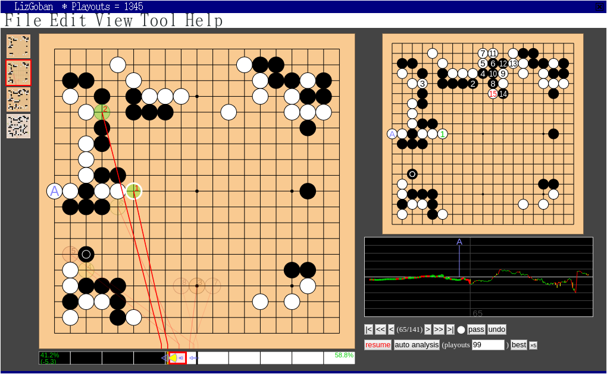

# LizGoban - Attachable Leela Zero GUI

LizGoban is an analysis tool of the game Go with
[Leela Zero](https://github.com/gcp/leela-zero).
It is an implementation of
[Lizzie](https://github.com/featurecat/lizzie)-style real-time UI
on [Electron](https://electronjs.org/).
Instead of having a full-featured board editor by itself,
it is attachable to [Sabaki](https://sabaki.yichuanshen.de/)
as subwindows.

Though Lizzie is amazingly useful, its setup is not easy
for many Go players because it needs Java.
In this project, the core feature of Lizzie is transported to JavaScript
so that they can taste the joy of real-time analysis.

Features:

* Colored suggestions
* Variation by mouse hover
* Subboard that always shows the principal variation
* Clickable & draggable win-rate graph with autoanalysis
* Win-rate bar with evaluations of suggested moves

Help needed:

* Graphic design
* Windows support

To try it (stand alone):

1. Install [Node.js](https://nodejs.org/) and type "npm install electron electron-config tmp @sabaki/sgf".
2. Build unreleased Leela Zero in "next" branch (or copy leelaz.exe in Lizzie-0.5 for Windows).
3. Put Leela Zero binary as "external/leelaz" together with its network weight as "external/network.gz".
4. Type "npx electron src".

To attach it to Sabaki:

1. Build a [customized Sabaki](https://github.com/kaorahi/Sabaki/tree/dump_state2) in "dump_state2" branch.
2. Put Sabaki binary as "external/sabaki".
3. Start LizGoban.
4. Click "attach to sabaki" button on LizGoban and wait for Sabaki window.
5. Put a stone on Sabaki and see it appears on LizGoban.

[Project Home](https://github.com/kaorahi/lizgoban)
[License (GPL3)](https://github.com/kaorahi/lizgoban/blob/master/LICENSE.txt)
