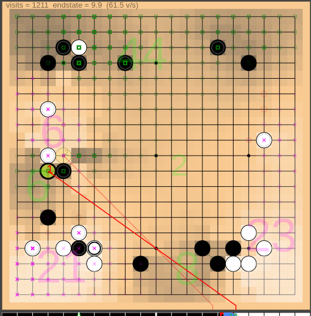

# LizGoban - Leela Zero & KataGo visualizer

LizGoban is an analysis tool of the game Go with
[Leela Zero](https://github.com/gcp/leela-zero)
and [KataGo](https://github.com/lightvector/KataGo).
It is an implementation of
[Lizzie](https://github.com/featurecat/lizzie)-style real-time UI
on [Electron](https://electronjs.org/).
Instead of having a full-featured board editor by itself,
it is attachable to [Sabaki](https://sabaki.yichuanshen.de/)
as subwindows.

## Highlights

1. Leela Zero does not tell the reason of suggestions. So LizGoban aims at a GUI for easy trial of what-if in addition to quick browse of proposed variations. For example, you can use any number of trial boards in parallel, discard a needless one by a single action, and restore the deleted one if necessary.
2. Though Lizzie is amazingly useful, its setup is not easy for many Go players because it needs Java. In this project, the core feature of Lizzie is transported to JavaScript so that they can taste the joy of real-time analysis.
3. Flexibility of JavaScript also enables quick experiments of fun features, e.g. watching Leela Zero vs. [ELF](https://facebook.ai/developers/tools/elf) with real-time detection of the difference between their plans before they play the move actually.
4. Leela Zero's suggestions are not 100% reliable, of course. We hope to get some signs when the suggested moves are unreliable. LizGoban visualizes convergence and consistency of estimations for this purpose. We can notice the case when we should wait for a little more analysis, and will never miss a new rising candidate like the one in the above screenshot.
5. Additionally, various small ideas are implemented, e.g. translucent stones for too long variations, different colors for good/bad/unexpected moves in the win-rate graph, etc.

See below for corresponding features.

## Features

Like Lizzie...

* Colored suggestions / Variation by mouse hover [2]
* Subboard that always shows the principal variation [2]
* Clickable & draggable win-rate graph with autoanalysis [2]

And more...

* Visualization of search progress via plots of (visits, winrate, prior) [4]
* Real-time display of area counts by KataGo [3]
* Trial boards that can be used like tabs in web browsers [1]
* Detection of inconsistency between analyses before/after a move [4]
* Watch Leela Zero vs. KataGo etc. with real-time comparison of their plans [3]
* Play against weakened Leela Zero in several ways [3]
* Keyboard shortcuts, e.g. "3" key for the third variation [5]
* Let-me-think-first mode in autoplay: plain board for n seconds and then suggestions for n seconds in each move [3]
* Personal exercise book that can be used like bookmarks in web browsers for random exercise [3]

## Usage

### Case I: CPU-only Leela Zero on 64bit Windows

Just download the [all-in-one package (*.exe)](https://github.com/kaorahi/lizgoban/releases) and double-click it. You do not need installation, configuration, additional downloads, etc.

### Case II: Leela Zero and KataGo on 64bit Windows with GPU

[BadukMegapack by wonsiks](https://github.com/wonsiks/BadukMegapack)
may be the easiest way to install LizGoban together with many other tools.
(Though it is not tested by the author of LizGoban,
who does not have a Windows machine.)

### Case III: Otherwise...

#### To try it (stand alone):

1. Install [Node.js](https://nodejs.org/).
2. Type "git clone https://github.com/kaorahi/lizgoban; cd lizgoban; npm install" on a terminal.
3. Put Leela Zero binary (version 0.17 or later) as "external/leelaz" together with its network weight as "external/network.gz".
4. Type "npm start". (Windows: Double-click lizgoban_windows.vbs.)

#### To configure it:

Start it as

    npm start -- -c config.json

with the file config.json:

    {"sgf_dir": "/foo/bar/sgf/"}

(Windows: Put the above config.json into the same folder as lizgoban_windows.vbs and double-click lizgoban_windows.vbs.)

Here is a more practical example of config.json:

~~~~
{
    "analyze_interval_centisec": 10,
    "sgf_dir": "/foo/bar/sgf/",
    "weight_dir": "/foo/bar/lz_weights/",
    "exercise_dir": "/foo/bar/exercise/",
    "max_cached_engines": 1,
    "preset": [
        {
            "label": "Leela Zero",
            "accelerator": "F1",
            "engine": ["/foo/bar/leelaz", "-g", "-w", "/foo/bar/network.gz"]
        },
        {
            "label": "KataGo",
            "accelerator": "F2",
            "engine": ["/foo/bar/katago", "gtp",
                       "-model", "/foo/bar/kata_network.gz",
                       "-config", "/foo/bar/gtp.cfg"]
        },
        {
            "label": "LZ vs. KATA",
            "empty_board": true,
            "engine": ["/foo/bar/leelaz", "-g", "-w", "/foo/bar/network.gz"],
            "engine_for_white": ["/foo/bar/katago", "gtp",
                       "-model", "/foo/bar/kata_network.gz",
                       "-config", "/foo/bar/gtp.cfg"]
        },
        {"label": "Hide hints", "accelerator": "F3", "board_type": "raw"},
        {"label": "Show hints", "accelerator": "F4", "board_type": "double_boards"}
    ]
}
~~~~

* analyze_interval_centisec: Update interval of analysis display (1 = 0.01sec).
* sgf_dir: Default directory for [Open SGF] and [Save SGF] menus. (*1)
* weight_dir: Default directory for [Load network weights] menu. (*1)
* exercise_dir: Directory for your personal exercise book. (*1)
* max_cached_engines: (Experimental) Maximum number of simultaneous engine processes. You can set this as 5 for quicker switch of 5 different engines / weights, for example, if your machine has enough spec.
* preset: You can switch the given settings by [Preset] menu in LizGoban. The first one is used as default.
  * label: Item name shown in [Preset] menu.
  * accelerator: Shortcut key like "Shift+F3", "CmdOrCtrl+F4", "Alt+F5", etc. It can be omitted as the above "LZ vs. KATA".
  * engine: Engine command. (*1)
  * engine_for_white: Alternative engine is used for white if this is set. (*1)
  * empty_board: Set it true for creating new empty board.
  * board_type: One of "double_boards", "double_boards_raw", "double_boards_swap", "double_boards_raw_pv", "raw", "suggest", "variation", "winrate_only". See [View] menu for their appearances.

(*1) In these items, you can use relative paths from the "working directory", that is the folder of `LizGoban*.exe` itself in the all-in-one package or `external/` otherwise. For example, you can simply write "leelaz" for `external/leelaz`.

For quick experiments, you can also use

    npm start -- -j '{"sgf_dir": "/foo/bar/baz/"}'
    npm start -- -c config.json -j '{"sgf_dir": "/foo/bar/baz/"}'
    etc.

on Mac or Linux. The latter option overwrites the former one in the second example.

In addition, LizGoban reads external/config.json (and config.json in the "working directory" in the above (*1)) beforehand if they exist.

#### To use KataGo and its score/ownership estimations:

Set KataGo like the above config.json and select it in [Preset] menu. See "KataGo" section in [Help] menu for details.

#### To enable endstate estimation (experimental, may be deleted in future):

This is based on [endstate_head branch by ihavnoid](https://github.com/leela-zero/leela-zero/issues/2331).

1. Build [a modified leelaz](https://github.com/kaorahi/leela-zero/tree/endstate_map) and rename "leelaz" to "leelaz_endstate".
2. Download [the weight file](https://drive.google.com/open?id=1ZotPAUG0zz-y7K-e934AHyYF8_StWmyN) and rename it to "network_endstate.gz".
3. Start LizGoban as `npm start -- -c config.json` with the file config.json:

~~~~
{
    "endstate_leelaz": ["/foo/bar/leelaz_endstate",
                        ["-g", "-w", "/foo/bar/network_endstate.gz"]],
    ...
}
~~~~

(Sorry for the ugly second brackets `[]` for backward compatibility.)
It is ignored when you are using KataGo, that gives more reliable estimations.

#### To attach it to Sabaki:

1. Build a [customized Sabaki](https://github.com/kaorahi/Sabaki/tree/dump_state2) in "dump_state2" branch.
2. Put Sabaki binary as "external/sabaki".
3. Start LizGoban.
4. Click "Attach Sabaki" in "Tool" menu of LizGoban and wait for Sabaki window.
5. Put a stone on Sabaki and see it appears on LizGoban.

## Major changes

### from 0.1.0

* Add "preset" to switch engines inside LizGoban.
* Add "max_cached_engines" for quicker switch of engines / weights.
* Enable autoplay between different engines.
* Add "personal exercise book".
* Improve komi features.
* Some items are moved to [Engine] menu.

### from unreleased versions

* The all-in-one package (*.exe) is offered for Windows.
* The launcher command is changed from "npx electron src" to "npm start".
* "Load engine" menu is deleted because it is misleading.

## Links

[Project Home](https://github.com/kaorahi/lizgoban) /
[License (GPL3)](https://github.com/kaorahi/lizgoban/blob/master/LICENSE.txt)
