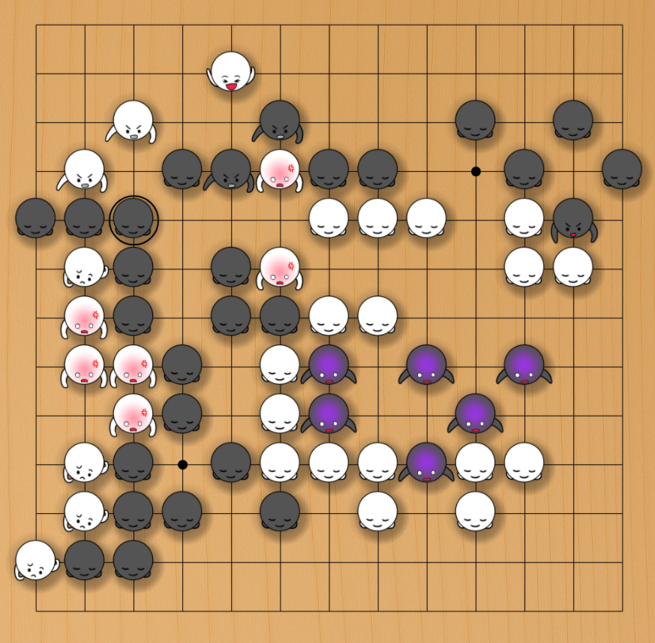

# LizGoban - Leela Zero & KataGo visualizer

LizGoban is an analysis tool of the game Go with
[Leela Zero](https://github.com/gcp/leela-zero)
and [KataGo](https://github.com/lightvector/KataGo).
It is an implementation of
[Lizzie](https://github.com/featurecat/lizzie)-style real-time UI
on [Electron](https://electronjs.org/)
with lots of original gimmicks.

 

(Facial stone images from [Goisisan](https://www.asahi-net.or.jp/~hk6t-itu/igo/goisisan.html))

## Table of contents

* [Highlights](#Highlights)
* [Features](#Features)
* [Setup](#Setup)
* [Usage](#Usage)
* [Major changes](#Changes)
* [Links](#Links)

## Highlights

1. AI does not tell the reason of suggestions. So LizGoban aims at a GUI for easy trial of what-if in addition to quick browse of proposed variations. For example, you can use any number of trial boards in parallel, discard a needless one by a single action, and restore the deleted one if necessary.
2. AI's suggestions are not 100% reliable, of course. We hope to get some signs when the suggested moves are unreliable. LizGoban visualizes convergence and consistency of estimations for this purpose. We can notice the case when we should wait for a little more analysis, and will never miss a new rising candidate like the one in the above screenshot.
3. AI can make game watching boring if we only focus on win rate. LizGoban provides hints to help us understand the game's development from multiple perspectives. For example, who invested in more thickness? When it was cashed to territories?

You will enjoy LizGoban if you are interested in the process as well as the result of the search by AI. You may also like experiments of various new ideas on Go GUI, e.g. [quick ladder check](https://github.com/kaorahi/lizgoban/issues/63), random generation of various playing styles, etc. If you just expect ordinary features and beautiful graphics, probably you will prefer other GUIs.

## Features

### Common features

* Colored suggestions / Variation by mouse hover like [Lizzie](https://github.com/featurecat/lizzie)
* Plots of winrate and estimated score
* Subboard that always shows the principal variation
* Blunder marks on stones and quick review of them by mouse click like [KaTrain](https://github.com/sanderland/katrain/)
* Auto-replay / Auto-analysis
* Quick switching of multiple engines
* Open URL (by drag & drop or clipboard)
* Save/load analyses to/from SGF in Lizzie-compatible format
* Restriction of analysis region like KaTrain
* Free editing of stones in the middle of a game
* [Import stone positions from diagram images](http://kaorahi.github.io/lizgoban/src/sgf_from_image/sgf_from_image.html) like [img2sgf](https://github.com/hanysz/img2sgf)
* [Experimental] Use your favorite images for the board and the stones

### Original features

* Trial boards that can be used like tabs in web browsers
* Watch Leela Zero vs. KataGo etc. with real-time comparison of their plans
* Personal exercise book that can be used like bookmarks in web browsers for random exercise
* Quick comparison of stones, ownerships, and areas of the current and past boards
* Side by side comparisons of two sequences:
  * the principal variation and the actual succeeding moves
  * the branch and the main sequence for nested SGFs
  * the plans by both players in AI vs. AI
* Let-me-think-first mode in autoplay: plain board for n seconds and then suggestions for n seconds in each move
* Preview of branches before switching for nested SGFs
* Configurable presets that enable easy switching of your favorite combinations on engine, weights, komi, board_type, etc.
* Random generation of various playing styles for matches vs. weak bots.
* Play pair match, "you & KataGo" vs. Leela Zero, etc.
* [Tsumego frame](https://github.com/lightvector/KataGo/pull/261#issuecomment-667661381) for solving life & death problems
* [Indicate ladder breakers and show continuation of ladders](https://github.com/kaorahi/lizgoban/issues/63) automatically. Enjoy watching [Ladder fight!](https://www.reddit.com/r/baduk/comments/llk8cj/ladder_fight/)
* [Experimental] [External control of GUI](https://github.com/kaorahi/lizgoban/issues/61) from another program

### Original visualizations

* Visualization of search progress via plots of visits, winrate, score, prior, ... for each suggested move
* Real-time display of area counts by KataGo
* Analysis of gains and losses in recent moves on the board that reveals overlooked side effects
* Larger fonts for inevitable moves in the suggested variation
* Marks for the preferred moves by "AIs for handicap games"
* Highlighting of unexpected good moves that are overlooked by engines
* Detection of inconsistency between analyses before/after a move as a check of their reliability
* Additional plots
  * cumulative score-losses by black and white that indicate mistakes of each player separately
  * ambiguity of life & death that indicates big fights, game stages (opening / middlegame / endgame), etc.
* Indicators that suggest highlight scenes of the game (ko fights, SOPPO)
* Translucent stones for too long variations as the above screenshot
* Ownerships of stones by facial expressions

## Setup

### 64bit Windows

Just download the [all-in-one package](https://github.com/kaorahi/lizgoban/releases). You can enjoy KataGo immediately without installation, configuration, additional downloads, etc.

### Other platforms (Mac, Linux, ...) or Windows with more flexible configuration

#### To use LizGoban with Leela Zero:

1. Install [Node.js](https://nodejs.org/) v12 or later.
2. Type `git clone https://github.com/kaorahi/lizgoban; cd lizgoban; npm install` on a terminal.
3. Put Leela Zero binary (version 0.17 or later) as `external/leelaz` together with its network weight as `external/network.gz`.
4. Type `npm start`. (Windows: Double-click `lizgoban_windows.vbs` or  `lizgoban_windows.ps1`.)

Use `npm start -- --no-sandbox` if you get an error like "The SUID sandbox helper binary was found, but is not configured correctly" and you do not want to fix it.

#### To use LizGoban with KataGo:

Follow the above 1 and 2. Place KataGo binary, its model, and its GTP configuration somewhere, say `/FOO/BAR/katago`, `/FOO/BAR/model.bin.gz`, and `/FOO/BAR/gtp.conf`. Then write `config.json` as follows.

~~~~
{
    "preset": [
        {
            "label": "KataGo",
            "engine": ["/FOO/BAR/katago", "gtp",
                       "-override-config", "analysisPVLen=50, defaultBoardSize=19",
                       "-model", "/FOO/BAR/model.bin.gz",
                       "-config", "/FOO/BAR/gtp.cfg"]
        }
    ]
}
~~~~

Start LizGoban as

    npm start -- -c config.json

(Windows: Put the above config.json into the same folder as lizgoban_windows.vbs and double-click lizgoban_windows.vbs.)

Never set `reportAnalysisWinratesAs` and `playoutDoublingAdvantagePla` in your *.cfg.

#### To configure LizGoban:

Here is a longer example of config.json for Leela Zero 0.17 and KataGo 1.4.4 or later.

~~~~
{
    "analyze_interval_centisec": 20,
    "autosave_deleted_boards": 5,
    "autosave_sec": 300,
    "sgf_dir": "/FOO/BAR/sgf/",
    "exercise_dir": "/FOO/BAR/exercise/",
    "max_cached_engines": 3,
    "preset": [
        {
            "label": "Leela Zero",
            "accelerator": "F1",
            "engine": ["/FOO/BAR/leelaz", "-g", "-w", "/FOO/LZ_NET/254.gz"]
        },
        {
            "label": "KataGo",
            "accelerator": "F2",
            "engine": ["/FOO/BAR/katago", "gtp",
                       "-override-config", "analysisPVLen=50, defaultBoardSize=19",
                       "-model", "/FOO/KATA_NET/g104-b20c256.gz",
                       "-config", "/FOO/BAR/gtp.cfg"]
        },
        {
            "label": "KataGo (always aggressive)",
            "match": true, "rules": "tromp-taylor", "komi": 0, "handicap": 5,
            "stone_style": "2D",
            "engine": ["/FOO/BAR/katago", "gtp",
                       "-override-config",
                       "analysisPVLen=50, defaultBoardSize=19, dynamicPlayoutDoublingAdvantageCapPerOppLead=0.00, playoutDoublingAdvantage=2.00",
                       "-model", "/FOO/KATA_NET/g104-b20c256.gz",
                       "-config", "/FOO/BAR/gtp.cfg"]
        },
        {
            "label": "LZ",
            "label_for_white": "KATA",
            "empty_board": true,
            "engine": ["/FOO/BAR/leelaz", "-g", "-w", "/FOO/LZ_NET/254.gz"],
            "engine_for_white": ["/FOO/BAR/katago", "gtp",
                       "-model", "/FOO/KATA_NET/g104-b20c256.gz",
                       "-config", "/FOO/BAR/gtp.cfg"]
        },
        {"label": "Hide hints", "accelerator": "F3", "board_type": "raw"},
        {"label": "Show hints", "accelerator": "F4", "board_type": "double_boards"}
    ]
}
~~~~

* analyze_interval_centisec: Update interval of analysis display (1 = 0.01sec).
* autosave_deleted_boards: Maximum number of deleted boards that are kept across sessions.
* autosave_sec: Auto-save frequency (1 = 1sec).
* sgf_dir: Default directory for [Open SGF] and [Save SGF] menus. (*1)
* exercise_dir: Directory for your personal exercise book. (*1)
* max_cached_engines: Maximum number of simultaneous engine processes. You can set this as 5 for quicker switch of 5 different engines / weights, for example, if your machine has enough spec.
* preset: You can switch the given settings by [Preset] menu in LizGoban. The first one is used as default.
  * label: Item name shown in [Preset] menu.
  * accelerator: Shortcut key like "Shift+F3", "CmdOrCtrl+F4", "Alt+F5", etc. It can be omitted as the above "LZ" item.
  * engine: Engine command. (*1)
  * engine_for_white: Alternative engine is used for white if this is set. (*1)
  * label_for_white: Additional item name when engine_for_white is given.
  * empty_board: Set it true for creating new empty board.
  * board_size: 9, 13, etc.
  * rules: See the comments for "rules" in gtp_example.cfg of KataGo.
  * komi: 7.5, 6.5, 0, -0.5, etc. (for KataGo)
  * handicap: Number of handicap stones.
  * match: Set it true for match vs. AI. Set it 3 for pair match (= AI plays 3 moves after your move) and [3, 0.2] for random pair match (you and the pair AI play with probability 0.8 and 0.2, respectively).
  * board_type: One of "double_boards", "double_boards_raw", "double_boards_swap", "double_boards_raw_pv", "raw", "suggest", "variation", "winrate_only". See [View] menu for their appearances.
  * stone_style: One of "2D", "2.5D", "3D", or "Face". (You need to set "face_image_rule" for "Face". See the next section.)
  * wait_for_startup: Set it false for engines other than Leela Zero, Leela, and KataGo.

(*1) In these items, you can use relative paths from the "working directory", that is the folder of `LizGoban*.exe` itself in the all-in-one package or `external/` otherwise. For example, you can simply write "leelaz" for `external/leelaz`.

It is recommended to put all Leela Zero weights into one directory and all KataGo weights into another directory for using [Load network weights] menu conveniently.
Delete obsolete "weight_dir" in your config.json if you wrote it.

Notes on KataGo:
KataGo plays aggressively for handicap games in "match vs. AI" or "AI vs. AI" after LizGoban 0.5.0-pre4. To disable this automatic setting, you need to specify `playoutDoublingAdvantage` explicitly in the above "engine" entry (not in KataGo's configuration file like `gtp_example.cfg`). After KataGo 1.3.4, you can add `defaultBoardSize=19` as the above example to shorten the initialization of 9x9 and 13x13. ("=19" is ok. It is replaced with 9 or 13 inside LizGoban automatically.)

For quick experiments, you can also use

    npm start -- -j '{"sgf_dir": "/foo/bar/baz/"}'
    npm start -- -c config.json -j '{"sgf_dir": "/foo/bar/baz/"}'
    etc.

on Mac or Linux. The latter option overwrites the former one in the second example.

In addition, LizGoban reads external/config.json (and config.json in the "working directory" in the above (*1)) beforehand if they exist.

#### To play stone sounds:

Prepare the sound files by yourself and place them in the `external/` directory. Then add the entry "sound_file" to config.json as shown below. In this setup, one of the three sound files will be played randomly for each move.

~~~~
{
    ...
    "sound_file": {
        "stone": ["stone1.wav", "stone2.wav", "stone3.wav"],
        "capture": ["capture.wav"],
        "pass": ["pass.wav"]
    },
    ...
}
~~~~

#### To show ownerships of stones by facial expressions:

Prepare stone images and put them into `external/` directory.
For example, images in [Goisisan](https://www.asahi-net.or.jp/~hk6t-itu/igo/goisisan.html) are used in the above screenshot.

Then add "face_image_rule" and "face_image_diff_rule" into config.json like this.

~~~~
{
    ...
    "face_image_rule": [
        [-0.8, "goisi_k4.png", "goisi_s4.png"],
        [-0.4, "goisi_k8.png", "goisi_s8.png"],
        [0.00, "goisi_k7.png", "goisi_s7.png"],
        [0.30, "goisi_k11.png", "goisi_s11.png"],
        [0.90, "goisi_k10.png", "goisi_s10.png"],
        [1.00, "goisi_k16.png", "goisi_s16.png"]
    ],
    "face_image_diff_rule": [
        [-1.0, "goisi_k15.png", "goisi_s15.png"],
        [-0.5, "goisi_k9.png", "goisi_s9.png"],
        [0.50, null, null],
        [1.00, "goisi_k5.png", "goisi_s5.png"],
        [2.00, "goisi_k14.png", "goisi_s14.png"]
    ],
    ...
}
~~~~

The former is applied only if the latter says null. Namely, when "ownership" = O and "change of ownership" = C,

* goisi_k15.png (black) or goisi_s15.png (white) for C < -1 (getting dead).
* goisi_k9.png or goisi_s9.png for -1 <= C < -0.5.
* face_image_rule for -0.5 <= C < 0.5.
  * goisi_k4.png or goisi_s4.png for O < -0.8 (dead).
  * goisi_k8.png or goisi_s8.png for -0.8 <= O < -0.4.
  * ...
  * goisi_k16.png or goisi_s16.png for 0.9 <= O <= 1 (alive).
* goisi_k5.png or goisi_s5.png for 0.5 <= C < 1.
* goisi_k14.png or goisi_s14.png for 1 <= C <= 2 (getting alive).

Set KataGo as the engine and select View > Stone > Face. You need to enable View > Ownership if you have disabled it.

#### To use [TamaGo](https://github.com/kobanium/TamaGo) 0.9.0 or later

Set "board_size" and "wait_for_startup" in config.json as follows.

~~~~
{
    ...,
    "preset": [
        ...,
        {
            "label": "TamaGo",
            "engine": ["/bin/python3", "/PATH/TO/main.py", "--model", "/PATH/TO/model.bin"],
            "board_size": 9,
            "komi": 7,
            "wait_for_startup": false
        },
        ...
    ]
}
~~~~

#### To replace images of board and stones (Experimental)

Put your favorite images of board and stones as `external/board.png`, `external/black.png`, and `external/white.png` (before starting LizGoban).

#### To control LizGoban from another program (Experimental)

[ref.](https://github.com/kaorahi/lizgoban/issues/61)

You can control lizgoban from its STDIN as follows (example on Linux).

~~~
$ cd lizgoban/
$ echo 'mimic("play", "D3"); mimic("play", "R4")' | npm start -- -j '{"repl": true}'
~~~

See `const api = ...` in src/main.js for the list of commands. "Debug log" in "Debug" menu will be also useful if you want to observe which API is called for each mouse/keyboard operation. For debugging, you may prefer to type `mimic(...)` directly on the console with "REPL" in "Debug" menu.

Please note that this feature is experimental and API etc. may be changed in future.

## Usage

For information about the displayed marks, shortcut keys, and other features, refer to the "Help" menu in the app.

## Major changes

### 0.8.*

* Blur ownership display. (Borrow the idea from [katrain#555](https://github.com/sanderland/katrain/issues/555).)
* Replace zone indicator with playing styles indicator.
* Add ownership distribution chart at the bottom left. (Press "x" key to enlarge it.)
* Add thin red background for "hot" periods in winrate graph.
* Add "ambiguity of areas" (faint gray line) and "settled territories" (faint green/pink dots) to score graph.
* Highlight settled areas by "v" key.
* Make long press of cursor keys smoother.
* Add sound feature. (You need to [prepare and set sound files](#sound) by yourself.)
* Change playing style of persona strategy. This is still being tested and might change in the future.
* Avoid unnatural tenuki in match vs. weakened AI.
* Add "Open recent" to File menu.
* Detect encoding of SGF files etc.
* [Support TamaGo](#TamaGo).

Incompatibilities:

* Upgrade libraries (Electron 28, etc.). So you may need to do "npm install" again.

### 0.7.*

* Random generation of various playing styles for matches vs. weak bots.
* Support the new feature ["ownershipStdev"](https://github.com/lightvector/KataGo/pull/500) in KataGo 1.10.0 (red backgrounds in the subboard), that looks like a heatmap of "KataGo's eye tracking".
* Support ["movesOwnership"](https://github.com/lightvector/KataGo/issues/608) in KataGo 1.11.0.
* Show the preferred moves by "AIs for handicap games" as the stronger/weaker side. (small blue up/down triangles on the board, sharpness of the triangles in the winrate bar)
* Add auto-adjustment for image imports.
* Add "Auto overview" into Tool menu so that one can turn it off.
* Add "Preferences" into Edit menu for convenience.
* Slightly improve bogus territory counts.
* Slightly improve ladder continuation.
* Use change of ownership in addition to ownership itself for facial stones.
* Guess the rule from komi if RU (rule) property is missing in SGF.

Incompatibilities:

* Upgrade libraries (Electron 18, etc.). So you may need to do "npm install" again.

### 0.6.*

* Indicate inevitability of each move by its font size in suggested variations (KataGo only).
* Show X mark on suggested variations when it is updated in the background.
* Improve loading of nested SGFs, e.g. [AlphaGo Games](https://deepmind.com/alphago-games-english), so that we can read them conveniently:
  * Push the corresponding key (d, e, ...) for each branch (d, e, ... in dotted squares) to preview its sequence with comments.
  * Click one of branches (or hit Enter key in the above preview) to watch it in another trial board.
  * Click "x" mark at the top right of the board to close it and return to the main branch.
* Implement side by side comparisons of the principal variation and the actual succeeding moves, etc.
* Add stars to personal exercise book. Starred exercises will appear more often.
* Support restriction of analysis region by Alt+drag like [KaTrain](https://github.com/sanderland/katrain/).
* Slightly improve Tsumego frame (boundary, analysis region).
* Insert/delete moves in the middle of the game by Ctrl+Shift+click.
* Insert a black (white) stone by b(w)+click.
* Add import of diagram images by Ctrl+V ("Paste" in "Edit" menu). [[Solve tsumego pictures (demo)]](https://github.com/kaorahi/lizgoban/issues/68) [[Online version of "SGF from Image"]](http://kaorahi.github.io/lizgoban/src/sgf_from_image/sgf_from_image.html)
* Add pair match to "File" menu and `preset` in `config.json`.
* Add "Random opening" into Tool menu for AI vs. AI (and "diverse" strategy in Match vs. AI) for more various openings.
* Add "Coordinates" into View menu.
* Add "resize to 19x19" into "Flip..." in "Edit" menu.
* Copy SGF comments to the clipboard when they are clicked.
* Accelerate quick overview.
* Automatically mark ladder breakers as "=" and [show the continuation of the ladder](https://github.com/kaorahi/lizgoban/issues/63) by "=" key (experimental).
* Experimentally support [external control of LizGoban](https://github.com/kaorahi/lizgoban/issues/61) from another program.

Incompatibilities:

* Upgrade libraries (Electron 11, etc.). So you may need to do "npm install" again.

### 0.5.*

* Support ownerships of stones by facial expressions.
* Support `*.gib`, `*.ngf`, `*.ugf`, and `*.ugi` in addition to `*.sgf`.
* Modify "File" menu slightly for convenience.
* Officially support reuse of analyses like Lizzie.
* Add "Save/Copy SGF with analysis" into menu. (compatible with Lizzie 0.7.2)
* Add more configurations (rules, komi, handicap, stone_style) into `preset` in `config.json`.
* Omit marks for too minor suggestions on the board.
* Automatically start quick overview after reading SGF.
* Experimentally add "Tool > Experimental > Tsumego frame" for solving life & death problems. (See "Tips" section in "Help" menu.)
* Improve display by "c" key + mouse hover on existing stones.
* Stop pondering in match vs. AI if human's move is played in pausing.
* Borrow some ideas from [KaTrain](https://github.com/sanderland/katrain/).
  * Show mistakes and actually punished scores on stones.
  * Click on a stone to temporarily show the past board.
  * Double-click on a stone to jump to the move.
  * [Fix wrong komi in Fox SGF.](https://github.com/sanderland/katrain/issues/177)
* Make KataGo aggressive for handicap games automatically in "match vs. AI" or "AI vs. AI". ("!" is appended to the engine names in the title bar.)
* In "AI vs. AI", show the principal variations of both AIs side by side by "1" key (keep holding down) if "Two boards A (main+PV)" is selected from "View" menu.
* Separate estimations for different komi etc. in winrate graph.
* Support HA (handicap) property in SGF.

Incompatibilities:

* Upgrade libraries (Electron 10, etc.). So you may need to do "npm install" again.

### 0.4.0

* Support better stone images. ("Stone" in "View" menu & experimental stone/board images in the above section)
* Support 9x9 and 13x13 in "File" menu. (See the above KataGo section to shorten their initialization.)
* Add "Rule" into "Edit" menu for KataGo v1.3.
* Add "Match vs. AI" into "File" menu.
* Add "Quick overview" into "Tool" menu.
* Enable "Undelete board" in Edit menu across sessions.
* Plot cumulative score loss.
* [Show mistakes over stones.](https://github.com/featurecat/lizzie/issues/671#issuecomment-586090067)
* Add buttons "?<" and ">?" for previous and next something. (comment, tag, mistake, ko resolution, illegal move)
* Add indicators that suggest highlight scenes of the game (ko fights, etc.).
* Separate estimations by different engines in winrate graph.
* Show coordinates by "c" key.
* Wrap long press of left/right arrow at the beginning/end of games for convenience.
* Recognize handicap stones.
* Read variations in SGF.
* Show start-up log when engine is down.
* Improve thumbnails (delay, color, etc.).
* Add Japanese help.
* Fix blur in HiDPI display.
* Experimentally support saving/loading analyses in SGF. (See the above section.)

Incompatibilities:

* Upgrade libraries (Electron 8, etc.). So you may need to do "npm install" again.
* Recommended config.json is modified for KataGo 1.3.4. (See above.)
* "weight_dir" in config.json is obsolete now. (See above.)
* "label_for_white" is added to "preset" in config.json.
* "Komi" and "Info" are moved from [Tool] to [Edit] menu.
* The shortcut key `CmdOrCtrl+?` is changed from open_exercise_dir to load_recent_exercise.

### 0.3.*

* Open URL by drag & drop or clipboard.
* Count stones separately in area counts. (See "KataGo" section in "Help" menu.)
* Flip & rotate the board randomly in exercise.

### 0.2.0

* Add "preset" to switch engines inside LizGoban.
* Add "max_cached_engines" for quicker switch of engines / weights.
* Enable autoplay between different engines.
* Add "personal exercise book".
* Improve komi features.
* The format of config.json is modified. (The obsolete format also works at present.)
* Some items are moved to [Engine] menu.

### 0.1.0

* The all-in-one package (*.exe) is offered for Windows.
* The launcher command is changed from "npx electron src" to "npm start".
* "Load engine" menu is deleted because it is misleading.

## Links

[Project Home](https://github.com/kaorahi/lizgoban) /
[License (GPL3)](https://github.com/kaorahi/lizgoban/blob/master/LICENSE.txt)
