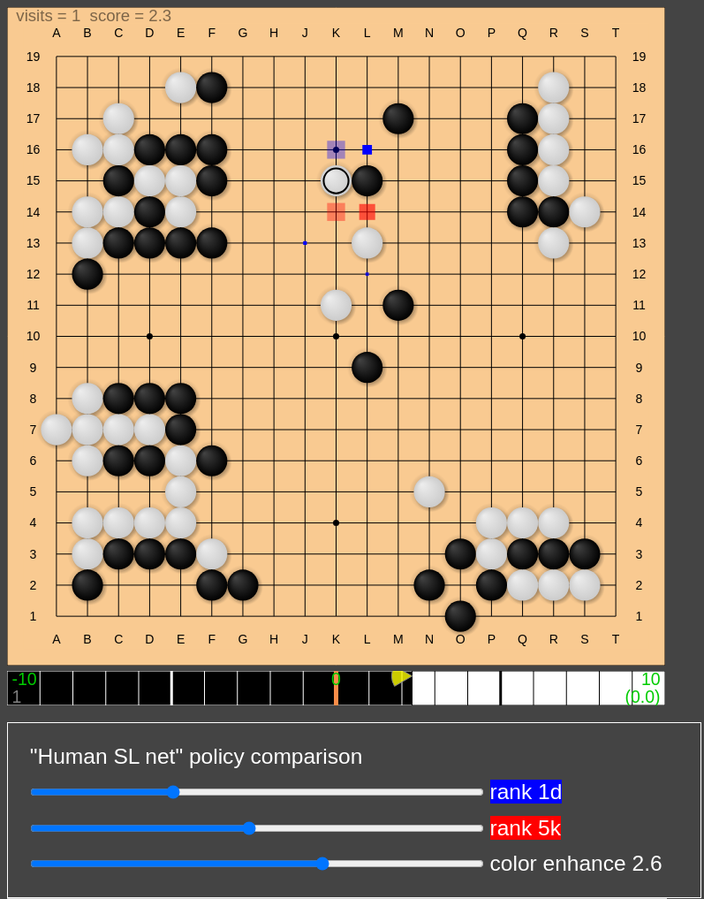

# Prototype features for "Human supervised learning early test net"



* Compare policies of 1d and 5k, for example
* Play games with any rank
* View normal KataGo analysis synchronously

This is just a very rough prototype. Everything can be changed in the future.

## Setup

1. (Model) Read [this message](https://discord.com/channels/417022162348802048/583775968804732928/1220910608883650650) in Discord (Computer Go Community) and verify that `humanslnet_gui.py` is functioning as expected.
2. (Engine) Check out [humanslnet_gtp2](https://github.com/kaorahi/KataGo/tree/humanslnet_gtp2) branch in a KataGo fork and find `python/humanslnet_gtp.py`.
3. (GUI) Check out LizGoban [humansl_proto1](https://github.com/kaorahi/lizgoban/tree/humansl_proto1) branch, type `npm i` to install dependencies, and create `config.json` as follows.

```
{
    "humansl_engine": {
        "engine": [
            "/bin/python", "/PATH/TO/humanslnet_gtp.py",
            "/bin/python", "/PATH/TO/humanslnet_server.py",
            "-checkpoint", "/PATH/TO/b18c384nbt-humanv0-test.ckpt",
            "-device", "cpu"
        ]
    },
    "preset": [
        {
            "label": "HumanSl",
            "engine": [
                "/bin/python", "/PATH/TO/humanslnet_gtp.py",
                "/bin/python", "/PATH/TO/humanslnet_server.py",
                "-checkpoint", "/PATH/TO/b18c384nbt-humanv0-test.ckpt",
                "-device", "cpu"
            ],
            "wait_for_startup": false
        },
        {
            "label": "KataGo",
            "engine": ["/PATH/TO/katago", "gtp",
                       "-config", "/PATH/TO/gtp_example.cfg",
                       "-override-config", "defaultBoardSize=19",
                       "-model", "/PATH/TO/kata1-b18c384nbt....bin.gz"]
        }
    ]
}
```

The combination of KataGo (OpenCL) and `humanslnet_server.py` (CPU) operates smoothly, whereas using CPU for both results in lags.

## Usage

* Start LizGoban: `npm start -- -c config.json`
* To compare policies, select the menu View > Human SL heatmap. Then click on the board to put stones.
* To play games with any rank, select the menu File > match vs. AI. Choose the AI's rank from the dropdown menu. Then click on the board or press the "start AI's turn" button.
* To view normal KataGo analysis synchronously, select the following menu items.
  * File > (new window)
  * View > Suggestions
  * Preset > KataGo (Use the space bar to start/stop analysis.)

In the heatmap, color = sign(p - q), size = max(p, q), opacity = abs(log(p / q)), where p and q are the policies of 5k and 1d, for example.

## Acknowledgements

Thanks to [lightvector](https://github.com/lightvector) for sharing the model and [dfannius](https://github.com/dfannius) for heatmap ideas.

## Link

[Project Home](https://github.com/kaorahi/lizgoban)
